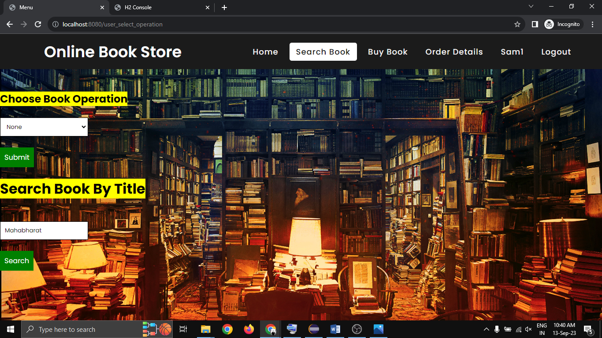
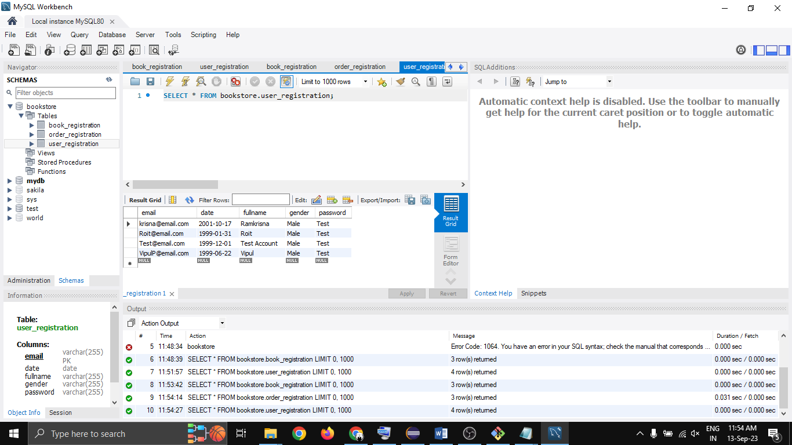

# Online Book Store
Online Book Store Using Spring Boot With H2 and MySQL Database (Thymleaf)


## Project Overview:
- Online book store platform for browsing, searching, and purchasing books
- Features include User Registration, Book Management, Book Details, and Order Management
- Users can Rate and Review Books
- Utilizes a database to store user, book, and order data


## Technology Used
- Thymleaf Template
- CRUD Features
- Manage View and Data Depends Upon Different User 
- Running on Two Database (MySQL & H2 Database)
- Sweetalerts Dialog Box
- Spring Boot JPA Crud Repository
- Easy to Understand Code
 

## Installation
- Just, Clone this repository - 
````bash 
git clone https://github.com/SLoharkar/Online-Book-Store.git
````
- Run File Using Any Java Application Like Eclipse IDE For Java Developer or Visual Studio Code


## Website Trailer


https://github.com/SLoharkar/Online-Book-Store/assets/68845746/6cfab389-498e-42ad-82d2-2c26738284f8


## Website Highlights
<p align="left" width="100%">


  








</p>


## Dependencies
- `Eclipse-IDE For Java Developer`
- `jdk-17`
- `Spring Boot Version 3.1.3`
- `Spring-boot-starter-Thymeleaf`
- `Windows OS`

